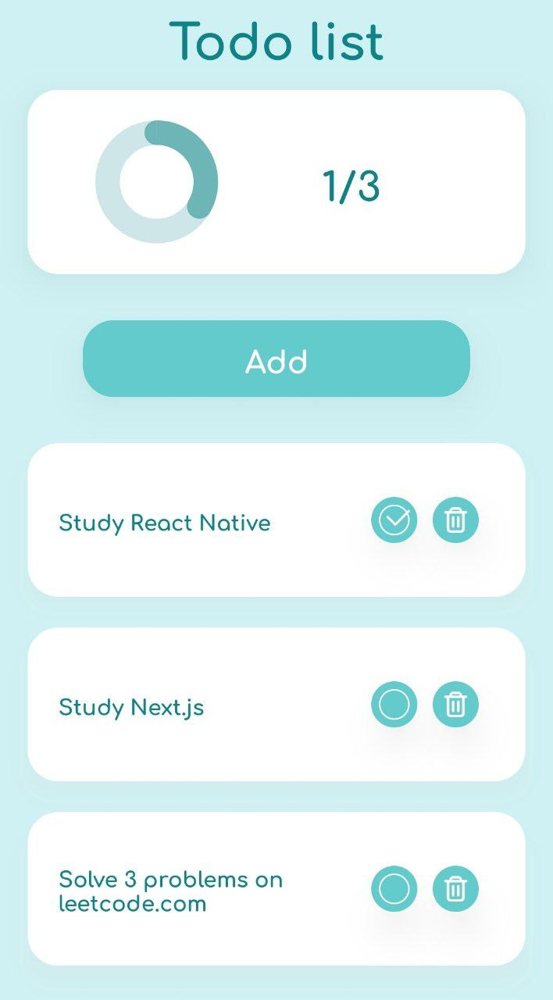
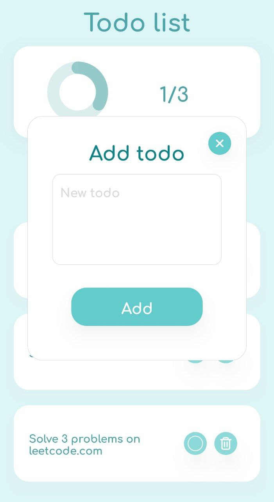

# Todo list

Todolist android application build with react native and expo-cli.

## Functionality:

- Add tasks via modal
- Delete tasks
- Mark as done tasks
- Save tasks to async storage
- Show statistics about complete and uncomplete tasks with progress ring diagram

## Technologies:

- React Native
- Expo
- Redux toolkit
- Redux persist
- Async storage
- React native chart kit
- Typescript
- Prettier

## Screenshots:

